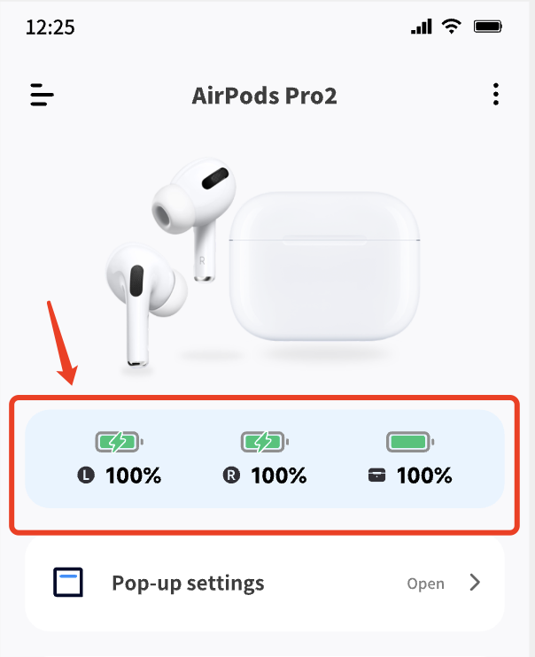

#### Function Description
- Once the earbuds have been added and connected, you can view the battery level display within the software.

#### II. FAQ
- [Battery access times out or does not update](/faq/battery_not_update)
- [How to display accurate power - to 1%](/faq/cacurate_power)
- [Charging capacity is not displayed](/faq/charging_not_displayed)

#### III. More Fun
- [Pop-up window that automatically connects](/basic/auto_pop_up)
- [Power level display in widgets](/func/widget)
- [Power level display in notification bar/status bar](/func/notification_bar)
