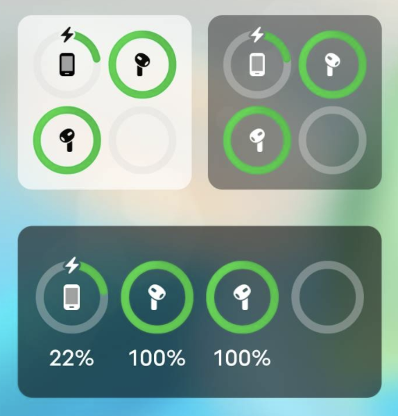

1. Press the blank section of the desktop and select "Add Widget".
2. Find the PodsLink widget in the list, drag it and drop it on your desktop
3. Click widget and select a widget from the list.

Different phones have different ways to add widgets

- [XIAOMI-Widget addition Guide](/rel/xiaomi_widget)
- [VIVO-Widget addition Guide](/rel/vivo_widget)
- [HUAWEI - Widget addition Guide](/rel/huawei_widget)
- [OPPO-Widget addition Guide](/rel/oppo_widget)
