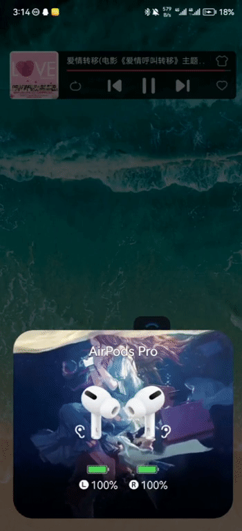

- Check the status of the small ear icon in the wearing state
- When worn, there is a small ear icon. Remove the earbuds and the small ear icon disappears. This is the reflection of light ear detection. When the small ear icon disappears, the music will be paused and the music will be displayed. (There is a 3-5 second delay in ear detection due to protocol acquisition)

- If it is a specific music player can not be detected in the ear
- You can check whether the "Line control" function of music players such as NetEase Cloud/Kugou is turned on or not.
- If you can't do ear detection when the app isn't open, Maybe the application background is cleaned up, and you can set up the background resident according to the guidelines to solve the problem.
