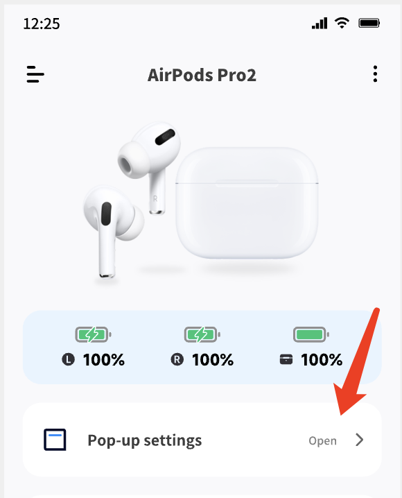

1. Make sure the auto pop-up is enabled in the app
   - The application will pop up when the headset is connected. You can put the headset in the charging bin, close the lid, and open the lid again after the Bluetooth disconnects.
   
2. The background resident is not set properly, resulting in the application background being killed.
   Click to view the background permanent setting, set the background permanent to ensure stable function
