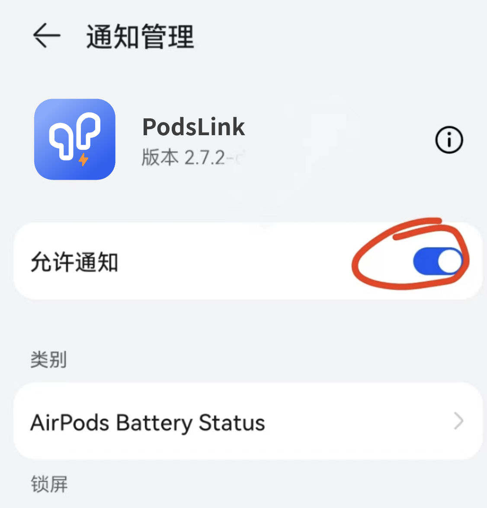
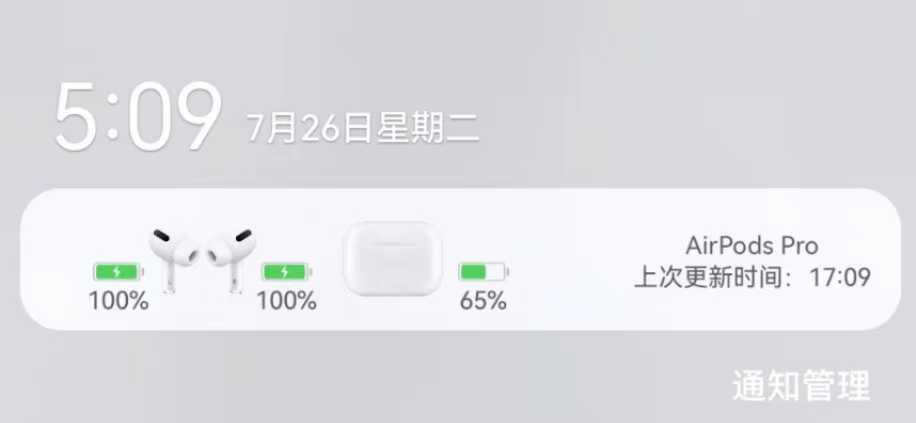

1. You can check your phone's system Settings - Notification Management - PodsLink - AirPods Battery Status to see if the app is disabled and the notification display is enabled.

2. The notification bar is displayed as follows: If the status bar icon is not displayed, please move to the status bar icon

