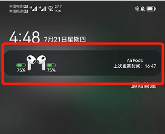

1. The status bar icon belongs to the notification icon. The status bar icon is displayed only when the notification is displayed
2. Make sure that the battery can be displayed in the popup window of the application, and the notification bar can be displayed normally

3. If you are the following models, you can check the status bar of the relevant models.

#### Huawei：
- If the system is before Hongmeng 3.0
  1. In the phone's system Settings - Notification - More Notification Settings - enable notifications when the icon is displayed.
  2. In the phone's system Settings - Notifications - PodsLink - AirPods Battery Status - Turn off silent notification.
- Hongmeng 4.0 and above systems are forced to use APP icon display. We have submitted feedback on this issue at the Pollen Club and there is currently no solution.

#### XIAOMI
- If it is a system before MIUI12.5.3, you can modify the style to the native style in the system Settings - Notification and Control Center - Notification Management - Notification display Settings of the phone.
- The MIUI of MIUI12.5.3 and above mandatory use of APP icon display. We have reported this problem to the MIUI team, and there is no solution for the time being.

#### Meizu
- Meizu does not support the status bar display on Flyme UI customization.

#### VIVO
- In the phone's system Settings - Notification and status bar there is an icon beautification, you can change the icon beautification to the original

