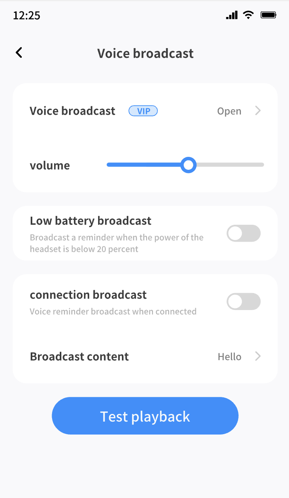

## Function description
- The voice broadcast function of the smart headset means that the headset can automatically identify and play information from the mobile phone, such as incoming reminder, low battery notification, wechat notification, QQ message notification, custom broadcast content, etc. Users only need to wear headphones to get the information they need anytime, anywhere, without having to check their phones frequently.

## Functional renderings

