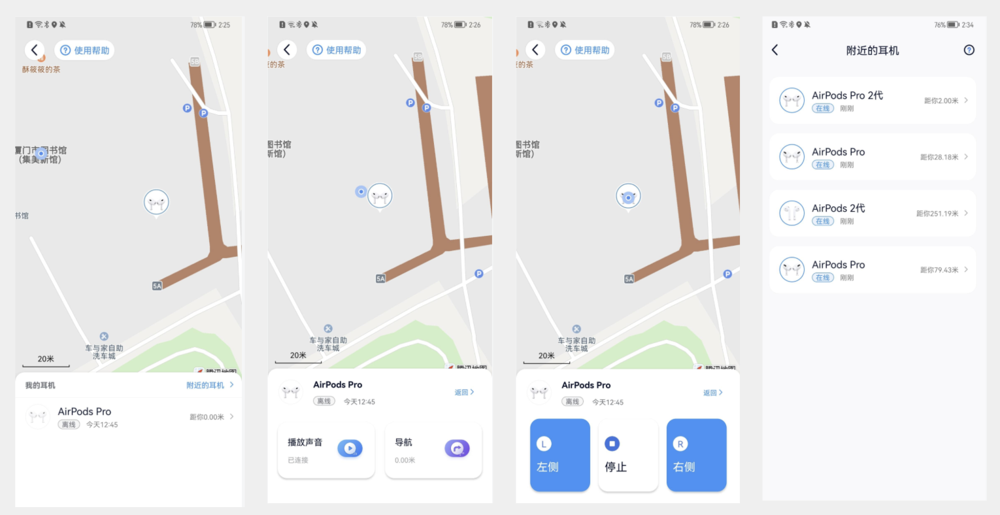

#### Function Introduction
For member users to provide auxiliary search headset function
- The app records the geo-location of the last headset connection (the app needs to be running in the background) to help you locate the approximate range of the headset;
- If headphones are nearby, try connecting them and playing a sound to help locate them;
- If you only lose one earphone, try to close the left/right channel to help confirm;
- If none of the above helps you, try the attached headset device.

#### Screenshot effect

#### Note:

When playing the sound, the sound will be adjusted to the maximum, and play, remember not to look for headphones while wearing.
