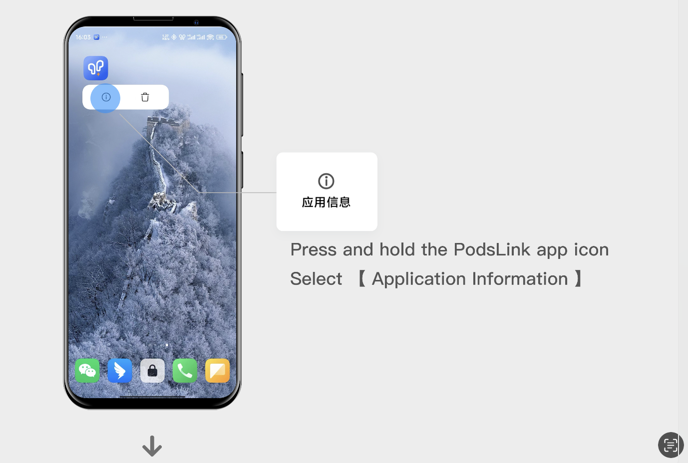
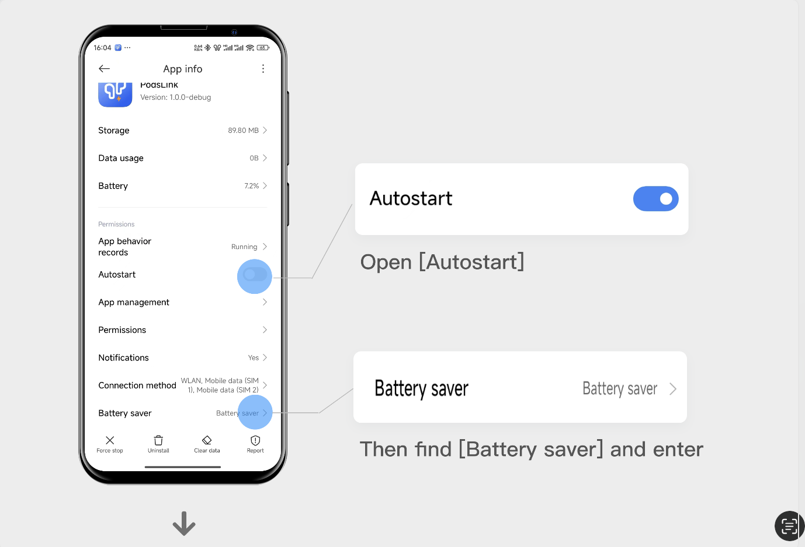
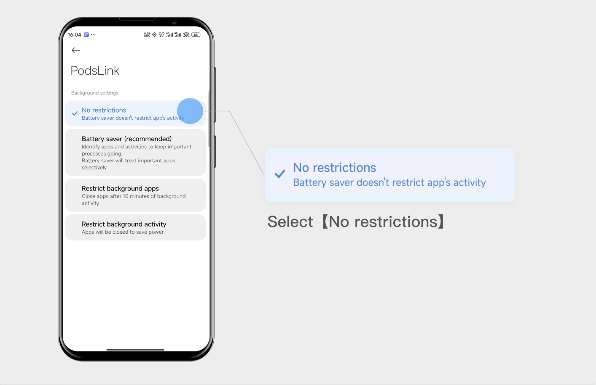
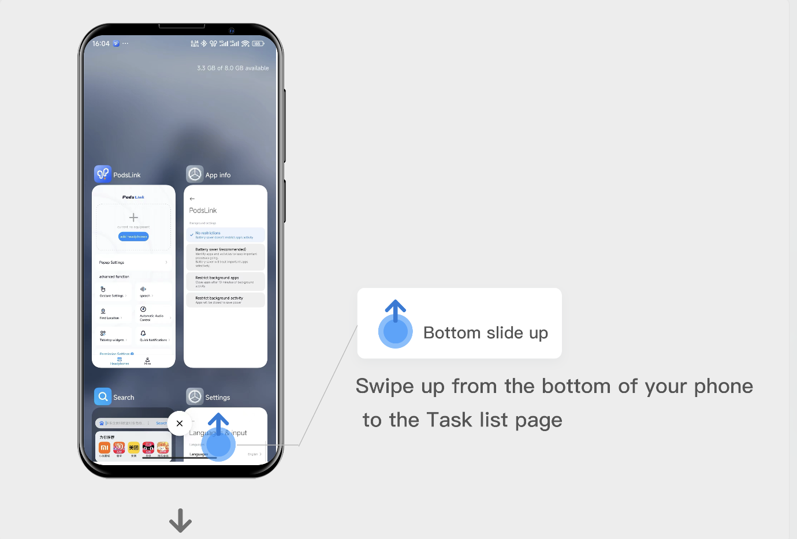
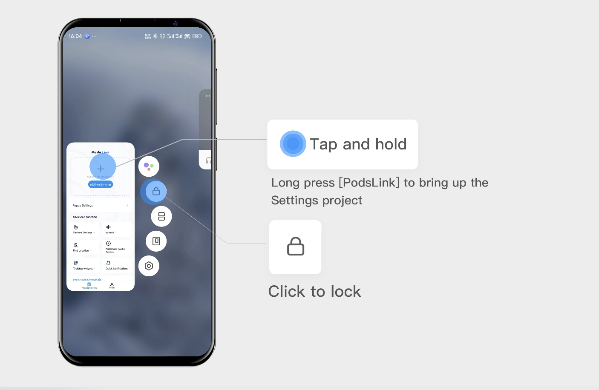

This article takes [XIAOMI HyperOS] as an example to teach you how to make functions such as pop-ups "more stable" and "more durable".

#### Step 1: Allow the application to self-start with power-saving optimization

#### Step 2: Put a lock on the app
- After locking, you can avoid cleaning yourself off by mistake should be applied

- Well, after the setup is complete, try the pop-up window
